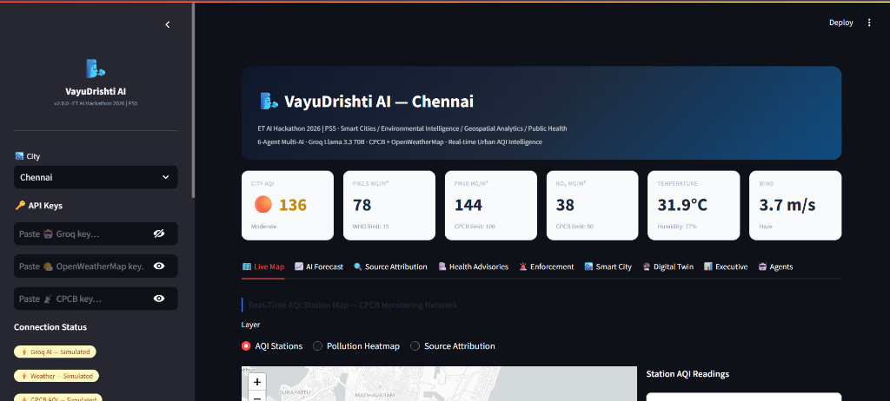

<div align="center">

# 🌬️ VayuDrishti AI

### AI-Powered Urban Air Quality Intelligence for Smart City Intervention

**🏆 ET AI Hackathon 2026 — Problem Statement 5 (PS5)**

*"Predict • Prevent • Protect"*

[](https://www.python.org/)
[](https://streamlit.io/)
[](https://groq.com/)
[](#-license)
[](#)

</div>

---

## 📌 Problem Overview

Urban air pollution is one of India's biggest public health challenges. Although the Central Pollution Control Board (CPCB) continuously monitors air quality through hundreds of stations, the available information is often limited to dashboards showing only **current AQI values**.

The challenge — **PS5** — is to build an AI-powered decision support platform that goes beyond monitoring and actually:

- Predicts future AQI
- Identifies pollution sources
- Generates multilingual health advisories
- Helps enforcement agencies prioritize inspections
- Supports smart city planning through AI

---

## 🎯 ET AI Hackathon Problem Statement

PS5 — AI-Powered Urban Air Quality Intelligence for Smart City Intervention

---

## 💡 Our Solution

**VayuDrishti AI** is a multi-agent AI platform that transforms raw environmental data into actionable intelligence for governments, smart cities, and citizens.

Instead of just displaying AQI numbers, VayuDrishti AI uses AI to:

- 📈 Predict air quality 24–72 hours in advance
- 🔍 Explain *why* pollution is rising, not just that it is
- 🏙️ Recommend concrete interventions to city administrators
- 🗣️ Generate multilingual advisories citizens can actually understand
- 🚨 Help enforcement teams prioritize where to act first
- 🔮 Simulate pollution control strategies *before* they're implemented (Digital Twin)

---

## ✨ Key Highlights

- 🤖 6 Specialized AI Agents
- 📈 24/48/72 Hour AQI Forecasting
- 🗺 Interactive Pollution Heatmaps
- 🔍 Pollution Source Attribution
- 🏥 AI-Generated Multilingual Health Advisories
- 🌍 Digital Twin What-if Simulation
- 🚨 Smart Enforcement Planning
- 📊 Executive Decision Dashboard
- ☁️ Streamlit Cloud Deployment Ready
- 🔒 Secure API Key Management

---

## 🎯 Objectives

- Improve public health awareness around air quality
- Enable proactive, not reactive, pollution control
- Assist pollution control boards with actionable intelligence
- Support Smart City and Clean Air Programme initiatives
- Make AQI data understandable for every citizen, in their own language

---

## 🏛️ Target Users

| User Group | How VayuDrishti AI Helps |
|---|---|
| 🧑🤝🧑 Citizens | Personalized, multilingual health advisories |
| 🏢 Pollution Control Boards | Source attribution + enforcement prioritization |
| 🏙️ Smart City Authorities | Intervention planning + Digital Twin simulation |
| 🏛️ Municipal Corporations | Executive dashboard + compliance scoring |
| 🔬 Environmental Researchers | Multi-city benchmarking + historical trends |
| 🏥 Healthcare Organizations | Vulnerable-group risk matrices |

---

## 🤖 Multi-Agent AI Architecture

```
                    CPCB AQI API
                         +
               OpenWeatherMap API
                         +
                Historical AQI Data
                         +
               Synthetic Fallback Data
                         │
                         ▼
                Data Processing Layer
              (validated · hardened · cached)
                         │
                         ▼
               AQI Forecasting Model
            (Gradient Boosting + Weather)
                         │
                         ▼
            ┌─────────────────────────────┐
            │     AI Multi-Agent System    │
            ├─────────────────────────────┤
            │  📡 AQI Forecast Agent        │
            │  🔍 Source Attribution Agent  │
            │  🏥 Health Advisory Agent     │
            │  🚨 Enforcement Agent         │
            │  🏙️ Smart City Planning Agent │
            │  🌐 Multilingual Agent        │
            └─────────────────────────────┘
                         │
                         ▼
               Streamlit Dashboard
                         │
                         ▼
        Interactive Maps · Charts · Executive Views
```

---

## 🧠 Detailed Agent Breakdown

### 📡 AQI Forecast Agent
Predicts air quality **24 / 48 / 72 hours** ahead using Gradient Boosting trained on historical AQI patterns and live weather features (wind, humidity, temperature, rainfall), with confidence-interval visualization and AI-generated plain-language explanations of *why* the forecast looks the way it does.

### 🔍 Source Attribution Agent
Estimates the dominant pollution source at each monitoring station using a multi-signal heuristic model (PM2.5/PM10 ratio, NO₂, SO₂, zone type, hour-of-day, wind speed, proximity to highways/industry):

- 🚗 Traffic
- 🏭 Industrial
- 🏗️ Construction
- 🔥 Waste Burning
- 🌫️ Dust
- 🌾 Biomass

Each source comes with a confidence score, not just a label.

### 🏥 Health Advisory Agent
Generates personalized, AI-written health guidance for vulnerable groups:

- Children (0–14)
- Elderly (60+)
- Pregnant Women
- Asthma Patients
- Outdoor Workers
- Heart Disease Patients

### 🌐 Multilingual Communication Agent
Converts every advisory into **English, Telugu, Tamil, and Hindi**, formatted correctly for the channel it's being sent through:

- 📱 Mobile Push
- 📨 SMS
- 📻 IVR
- 💬 WhatsApp
- 🖥️ Public Displays

### 🚨 Enforcement Agent
Supports pollution control authorities with:

- Priority-ranked inspection hotspots (Critical / High / Medium / Low)
- Nearest-neighbor optimized inspection routing
- AI-generated, evidence-backed enforcement briefs per station

### 🏙️ Smart City Planning Agent
Recommends concrete city-level interventions — traffic restrictions, construction controls, industrial inspections, school advisories, emergency protocols — and includes a **Digital Twin** what-if simulator to model the AQI impact of an intervention before it's implemented.

---

## 📊 System Workflow

1. **Ingest** — Pull live CPCB AQI + OpenWeatherMap data (or fall back to realistic simulated data if APIs are unavailable)
2. **Validate** — Every dataframe is schema-checked, missing pollutant columns are auto-filled, NaNs and duplicates are repaired
3. **Attribute** — Source Attribution Agent scores each station's likely pollution sources
4. **Forecast** — AQI Forecast Agent projects 24/48/72h ahead with confidence bands
5. **Advise** — Health Advisory + Multilingual Agents generate citizen-ready alerts
6. **Enforce** — Enforcement Agent ranks and routes inspection priorities
7. **Plan** — Smart City Agent recommends interventions and simulates their impact
8. **Visualize** — Everything renders live across 9 interactive Streamlit dashboard tabs

---

## ✅ PS5 Feature Coverage

| Requirement | Status |
|---|:---:|
| Live AQI Monitoring | ✅ |
| Hyperlocal AQI Forecasting (24–72h) | ✅ |
| Geospatial Source Attribution | ✅ |
| Pollution Heatmaps | ✅ |
| Smart Enforcement Intelligence | ✅ |
| Digital Twin / What-If Simulation | ✅ |
| Multilingual Citizen Advisory | ✅ |
| Multi-Agent AI Architecture | ✅ |
| Weather-Aware Modelling | ✅ |
| Multi-City Comparative Dashboard | ✅ |
| Executive / Compliance Dashboard | ✅ |
| Production-Hardened Data Pipeline | ✅ |

---

## 🚀 Features

<table>
<tr>
<td valign="top" width="50%">

**📊 Live Dashboard**
- Real-time AQI, weather & KPI cards
- City-level risk scoring
- Six-agent status panel

**🗺️ Interactive Maps**
- AQI station markers
- Pollution heatmaps
- Source attribution overlay
- Optimized inspection routes

**📈 AI Forecast**
- 24h / 48h / 72h horizons
- Confidence interval bands
- AI-generated explanations

</td>
<td valign="top" width="50%">

**🏥 Health Advisories**
- AI-generated, per vulnerable group
- 4-language support
- Risk matrix visualization

**🌍 Digital Twin**
- Traffic reduction scenarios
- Construction bans
- Industrial shutdowns
- Rainfall washout effects
- Combined intervention modeling

**📊 Executive Dashboard**
- Multi-city benchmarking
- Compliance scoring
- Trend & heatmap analytics

</td>
</tr>
</table>

---

## 📸 Screenshots

<div align="center">
  
  <p><i>VayuDrishti AI Live Dashboard Overview</i></p>
</div>

---

## 🛠️ Tech Stack

| Layer | Technology |
|---|---|
| **Frontend** | Streamlit |
| **Backend** | Python 3.11 / 3.12 |
| **Machine Learning** | Scikit-learn (Gradient Boosting) |
| **Generative AI** | Groq — Llama 3.3 70B |
| **Maps** | Folium + OpenStreetMap |
| **Charts** | Plotly |
| **APIs** | CPCB (data.gov.in) · OpenWeatherMap · Groq |

---

## 📂 Project Structure

```
vayu_drishti_ai/
│
├── app.py                     # Main Streamlit application (9-tab dashboard)
├── requirements.txt           # Pinned dependencies
├── README.md                  # You are here
├── .env.example                # API key template
│
├── config/
│   └── constants.py           # Cities, AQI scale, pollution sources, scenarios
│
├── agents/
│   └── agent_system.py        # All 6 AI agents (Forecast, Attribution, Health,
│                               #  Enforcement, Smart City, Multilingual)
│
├── utils/
│   ├── data_engine.py         # CPCB + OpenWeatherMap + synthetic fallback
│   ├── map_builder.py         # Folium map constructors
│   └── helpers.py             # Defensive helpers (safe_mean, ensure_pollutants,
│                               #  validate_df, safe_chart, status_badge, etc.)
│
├── pages/                     # (reserved for future multi-page expansion)
├── assets/                    # (reserved for branding/static assets)
└── data/                      # (local cache, auto-created at runtime)
```

---

## 🔑 API Configuration

| API | Purpose | Required? |
|---|---|:---:|
| **Groq** | Powers all 6 AI agents (forecast explanations, health advisories, enforcement briefs, intervention plans) | Optional |
| **OpenWeatherMap** | Live temperature, humidity, wind, rainfall | Optional |
| **CPCB / data.gov.in** | Live AQI station readings | Optional |

> 🛡️ **The application never crashes without API keys.** Every service automatically falls back to realistic, CPCB-pattern-seeded simulated data — the full dashboard remains fully functional and demo-ready at all times.

API keys are entered as **password fields only** in the sidebar, are never logged or printed, and are displayed only as a green **"Connected"** status badge — the actual key value is never shown anywhere in the UI.

---

## ⚙️ Installation

```bash
# 1. Clone the repository
git clone https://github.com/YOUR_USERNAME/VayuDrishti-AI.git
cd VayuDrishti-AI

# 2. Install dependencies
pip install -r requirements.txt

# 3. Configure API keys (optional — app works without these)
cp .env.example .env
# Edit .env and add your keys

# 4. Run the app
streamlit run app.py
```

The dashboard will open automatically at `http://localhost:8501`.

---

## ☁️ Streamlit Cloud Deployment

```bash
# 1. Push this repository to GitHub
git add .
git commit -m "VayuDrishti AI v2.0 — ET AI Hackathon 2026"
git push origin main

# 2. Go to share.streamlit.io
# 3. Click "New app" → connect this repository → select app.py as the entry point
# 4. Under App Settings → Secrets, add:
GROQ_API_KEY = "your_groq_key"
OWM_API_KEY  = "your_openweathermap_key"
CPCB_API_KEY = "your_cpcb_key"

# 5. Deploy — live URL is ready within ~60 seconds
```

---

## 🎬 Demo Walkthrough

| Step | Tab | What to Show |
|---|---|---|
| 1 | 🗺️ Live Map | Toggle AQI / heatmap / source layers, click a station popup |
| 2 | 📈 AI Forecast | 72h forecast with confidence band, click AI explanation |
| 3 | 🔍 Source Attribution | Donut chart of pollution sources for a selected station |
| 4 | 🏥 Health Advisories | Generate a Telugu/Tamil advisory for "Children" |
| 5 | 🚨 Enforcement | Priority cards + optimized inspection route map |
| 6 | 🏙️ Smart City | AI-generated intervention plan for current AQI |
| 7 | 🔮 Digital Twin | Run "All Interventions" scenario, view before/after gauges |
| 8 | 📊 Executive | Compliance score, multi-city benchmarking table |
| 9 | 🤖 Agents | Architecture diagram + PS5 feature coverage checklist |

---

## 📊 Judging Criteria Mapping

| Criteria | Weight | How VayuDrishti AI Delivers |
|---|:---:|---|
| **Innovation** | 25% | 6-agent architecture, Digital Twin what-if simulation, weather-aware ML forecasting |
| **Business Impact** | 25% | Source attribution → targeted enforcement, intervention plans with measurable lives-protected estimates |
| **Technical Excellence** | 20% | Gradient Boosting + confidence intervals, TSP-optimized routing, production-hardened data pipeline |
| **Scalability** | 15% | 12-city architecture out of the box, modular agent design, one-click Streamlit Cloud deploy |
| **User Experience** | 15% | 9-tab interactive dashboard, multilingual advisories, zero-crash failsafe design |

---

## 🌟 Future Scope

- 🛰️ Satellite imagery integration (Sentinel, MODIS) for source verification
- 📟 Live IoT/CAAQMS sensor network integration
- 📱 Dedicated citizen mobile app
- 💬 WhatsApp Business API chatbot for instant AQI queries
- 🚁 Drone-based hotspot verification for enforcement teams
- 🧠 Deep learning (LSTM/Transformer) forecasting upgrade

---

## 👥 Team Shakti2

| Name | Role |
|---|---|
| **Nanda Gunasri** | Developer |
| **Jinkala Sunitha** | Developer |

**Institution:** Mohan Babu University  
**Department:** B.Tech Computer Science Engineering  

---

## 🏆 ET AI Hackathon 2026

**Problem Statement 5 — AI-Powered Urban Air Quality Intelligence for Smart City Intervention**

---

## 📜 License

This project is licensed under the **MIT License** — see the [LICENSE](LICENSE) file for details.

---

<div align="center">

### ⭐ VayuDrishti AI — Predict • Prevent • Protect

*Built by Team Shakti2 for ET AI Hackathon 2026*

If this project helped you, consider giving it a ⭐ on GitHub!

</div>
